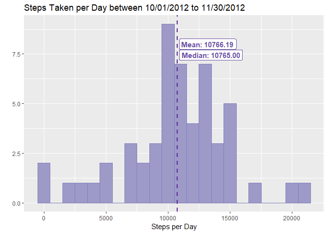
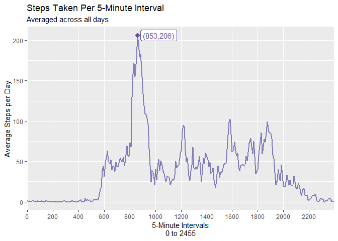
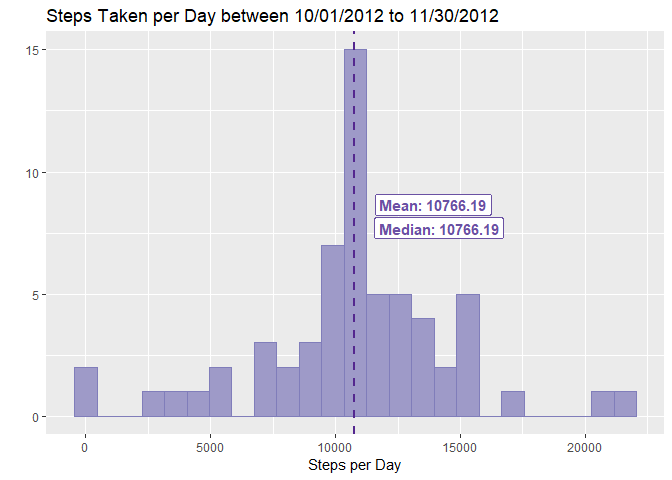
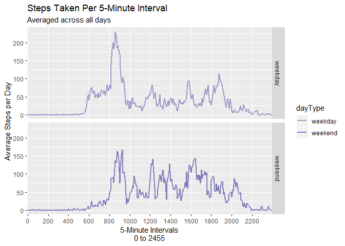

Reproducible Research Project 1
================
Katie M Brown
February 25, 2019


### Loading and Pre-processing data
In this section I will:

1. Check for a directory and create on if it doesn't exist
2. Check for the zip file to be downloaded and create it if it doesn't exist
3. Check for to unzipped .csv file and unzip file if it doesn't exist
4. Read the data from .csv into a DF called activity
5. Look over the data and assess for transformations and other processing


```r
# Step 1:
if(!file.exists("./data")) {
      dir.create("./data")
}

# Step 2:
if(!file.exists("./data/activity.zip")) {
      url <- 'https://d396qusza40orc.cloudfront.net/repdata%2Fdata%2Factivity.zip'
      download.file(url, destfile = './data/activity.zip',method='curl' )
}

# Step 3: 
if(!file.exists("./data/activity.csv")) {
      unzip('./data/activity.zip',exdir = './data')
}

# Step 4:
activity <- read.csv('data/activity.csv')

# Step 5:
str(activity)
```

```
## 'data.frame':	17568 obs. of  3 variables:
##  $ steps   : int  NA NA NA NA NA NA NA NA NA NA ...
##  $ date    : Factor w/ 61 levels "2012-10-01","2012-10-02",..: 1 1 1 1 1 1 1 1 1 1 ...
##  $ interval: int  0 5 10 15 20 25 30 35 40 45 ...
```

```r
names(activity)
```

```
## [1] "steps"    "date"     "interval"
```

```r
head(activity)
```

```
##   steps       date interval
## 1    NA 2012-10-01        0
## 2    NA 2012-10-01        5
## 3    NA 2012-10-01       10
## 4    NA 2012-10-01       15
## 5    NA 2012-10-01       20
## 6    NA 2012-10-01       25
```

```r
tail(activity)
```

```
##       steps       date interval
## 17563    NA 2012-11-30     2330
## 17564    NA 2012-11-30     2335
## 17565    NA 2012-11-30     2340
## 17566    NA 2012-11-30     2345
## 17567    NA 2012-11-30     2350
## 17568    NA 2012-11-30     2355
```

```r
# After seeing NAs in both head and tail, I decide to sum the non-NAs to verify
# I have data in the steps column
sum(!is.na(activity$steps))
```

```
## [1] 15264
```

```r
# Data looks good except for the "date" column. Changed to a date object here:
activity$date <- as.Date(activity$date)
```

### What is mean total number of steps taken per day?
In this section I will:

1. Calculate the total number of steps taken per day while ignoring NAs
2. Make a histogram of the total number of steps taken each day
      + First I will import appropriate libraries and color palette
      + Then I will change options to allow for appropriate decimal output
      + Finally, I will create the histogram using ggplot2
3. Calculate and report the mean and median of the total number of steps taken per day


```r
# Step 1:
per_day <- aggregate(activity["steps"], by=activity["date"], sum)

# Step 2:
library(dplyr)
library(RColorBrewer)
library(ggplot2)
shades <- brewer.pal(9, "Purples")[c(5:8)]

options(digits = 9)

ggplot() + aes(per_day$steps) + geom_histogram(binwidth=1000, colour=shades[2], fill=shades[1]) +
      geom_vline(xintercept=mean(per_day$steps,na.rm = TRUE), lwd=1, linetype=2, color=shades[4]) +
      geom_label(x=13200, y=8, aes(fontface=2),color=shades[3], 
                label = paste('Mean:',format(round(mean(per_day$steps, na.rm=TRUE), 2), nsmall = 2))) +
      geom_label(x=13450, y=7.45, aes(fontface=2),color=shades[3], 
                 label = paste('Median:',format(round(median(per_day$steps, na.rm=TRUE), 2), nsmall = 2))) +
      xlab("Steps per Day") +
      ylab("") +
      ggtitle("Steps Taken per Day between 10/01/2012 to 11/30/2012")
```

<!-- -->

```r
# Step 3:
step_mean <- round(mean(per_day$steps, na.rm=TRUE), 2)
step_median <- round(median(per_day$steps, na.rm=TRUE), 2)
c("Mean"= step_mean, "Median" = step_median)
```

```
##     Mean   Median 
## 10766.19 10765.00
```

### What is the average daily activity pattern?
In this section I will:

1. Make a time series plot of the 5-minute interval (x-axis) and the average number of steps taken, averaged across all days (y-axis)
      + First I will set interval to a factor variable
      + Use aggregate() function to find the mean of steps by the interval
      + Last, I will create the line graph
2. Calculate and report which 5-minute interval, on average across all the days in the dataset, contains the maximum number of steps


```r
# Step 1:
activity$interval <- as.factor(activity$interval)

per_interval <- aggregate(activity["steps"], by=activity["interval"], mean, na.rm=TRUE)

ggplot(data=per_interval, aes(x=interval, y=steps, group=1),antialias="none") +
      geom_line(color=shades[2],size=.8) +
      scale_x_discrete(breaks=seq(0,2500,by=200), labels=seq(0,2500,by=200)) +
      xlab("5-Minute Intervals\n0 to 2455") +
      ylab("Average Steps per Day") +
      ggtitle("Steps Taken Per 5-Minute Interval",subtitle="Averaged across all days") + 
      geom_point(data=per_interval,aes(x=per_interval$interval[which.max(per_interval$steps)],
                                      y=max(per_interval$steps)), size = 3, color=shades[3]) +
      geom_label(data=subset(per_interval, interval == 835),
            aes(interval,steps,label='(853,206)'),nudge_x=20, color = shades[3])
```

<!-- -->

```r
# Step 2:
maxInterval <-per_interval[which.max(per_interval$steps),1]
setNames(as.numeric(as.character(maxInterval)),c("Interval with Max Average Steps"))
```

```
## Interval with Max Average Steps 
##                             835
```

### Imputing missing values
In this section I will:

1. Calculate and report the total number of missing values in the dataset
2. Devise a strategy for filling in all of the missing values in the dataset. 
      + The stragegy I used is: **mean per 5-minute interval**
3. Create a new dataset that is equal to the original dataset but with the missing data filled in.
4. Make a histogram of the total number of steps taken each day and Calculate and report the mean and median total number of steps taken per day. 
      + Do these values differ from the estimates from the first part of the assignment? 
      + What is the impact of imputing missing data on the estimates of the total daily number of steps?


```r
# Step 1:
num_nas <- sum(is.na(activity$steps))
c("Number of NA Values" = num_nas)
```

```
## Number of NA Values 
##                2304
```

```r
# Step 2:
activity_imp <- activity %>% group_by(interval) %>% 
      mutate(steps = ifelse(is.na(steps), mean(steps, na.rm = TRUE), steps))

# Step 3:
activity_imp <- as.data.frame(activity_imp)
num_nas <- sum(is.na(activity_imp$steps))
c("Number of NA Values" = num_nas)
```

```
## Number of NA Values 
##                   0
```

```r
# Step 4:
per_day_imp <- aggregate(activity_imp["steps"], by=activity_imp["date"], sum)

ggplot() + aes(per_day_imp$steps) + geom_histogram(binwidth=900, colour=shades[2], fill=shades[1]) +
      geom_vline(xintercept=mean(per_day_imp$steps), lwd=1, linetype=2, color=shades[4]) +
      geom_label(x=13920, y=8.65, aes(fontface=2),color=shades[3], 
                label = paste('Mean:',format(round(mean(per_day_imp$steps), 2), nsmall = 2))) +
      geom_label(x=14140, y=7.7, aes(fontface=2),color=shades[3], 
                 label = paste('Median:',format(round(median(per_day_imp$steps), 2), nsmall = 2))) +
      xlab("Steps per Day") +
      ylab("") +
      ggtitle("Steps Taken per Day between 10/01/2012 to 11/30/2012")
```

<!-- -->

```r
# Step 5:
step_mean_imp <- round(mean(per_day_imp$steps), 2)
step_median_imp <- round(median(per_day_imp$steps), 2)

r1<- c("Mean"= step_mean, "Median" = step_median)
r2<- c("Mean" = step_mean_imp, "Median" = step_median_imp)
df_imp <- rbind(r1,r2)
rownames(df_imp) <- c('Before Mean Imputation', 'After Mean Imputation')
knitr::kable(df_imp, caption = "Before and After Mean Imputation")
```


Table: Before and After Mean Imputation

                              Mean     Median
-----------------------  ---------  ---------
Before Mean Imputation    10766.19   10765.00
After Mean Imputation     10766.19   10766.19

### Are there differences in activity patterns between weekdays and weekends?
In this section I will:

1. Create a new factor variable in the dataset with two levels - "weekday" and "weekend"
      + I accomplished this by writing a function called isWeekend that returns a
      factor value of "weekend" or "weekday"
2. Make a panel plot containing a time series plot of the 5-minute interval (x-axis) and the average number of steps taken, averaged across all weekday days or weekend days (y-axis)


```r
# Step 1:
isWeekend <- function(dateVar){
      weekendList <- c("Saturday","Sunday")
      if(weekdays(dateVar) %in% weekendList) {
            as.factor("weekend")
      } else { as.factor("weekday") }
}

activity_imp$dayType <- activity_imp$date %>% sapply(isWeekend) 
knitr::kable(head(activity_imp),caption = 'New variable "dayType" added to dataset' )
```


Table: New variable "dayType" added to dataset

       steps  date         interval   dayType 
------------  -----------  ---------  --------
 1.716981132  2012-10-01   0          weekday 
 0.339622642  2012-10-01   5          weekday 
 0.132075472  2012-10-01   10         weekday 
 0.150943396  2012-10-01   15         weekday 
 0.075471698  2012-10-01   20         weekday 
 2.094339623  2012-10-01   25         weekday 

```r
# Step 2:
per_int_daytyp <- activity_imp %>% group_by(interval,dayType) %>% summarize(mean_steps = mean(steps))
names(shades) <- levels(per_int_daytyp$dayType)
colScale <- scale_colour_manual(name = "dayType",values = shades)
ggplot(per_int_daytyp, aes(x=interval, y=mean_steps, group=dayType, color=dayType),antialias="none") + 
      geom_line(size=.8) + 
      scale_x_discrete(breaks=seq(0,2500,by=200), labels=seq(0,2500,by=200)) +
      xlab("5-Minute Intervals\n0 to 2455") +
      ylab("Average Steps per Day") +
      ggtitle("Steps Taken Per 5-Minute Interval",subtitle="Averaged across all days") +
      facet_grid(dayType ~ .) + colScale
```

<!-- -->
